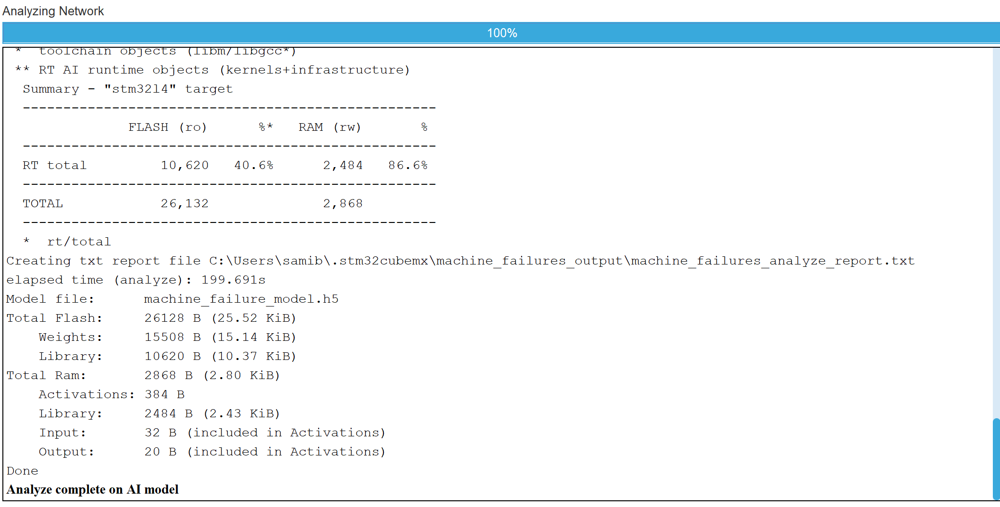
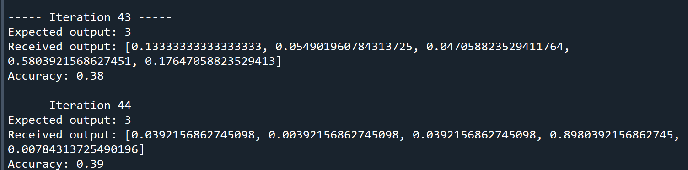
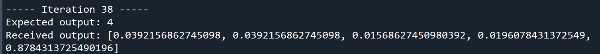

# 🔧 Maintenance préditive et DNN — STM32L4R9

> Entraînement et déploiement d'un réseau de neurones pour la détection de pannes industrielles sur microcontrôleur embarqué.

**Auteurs :** Sami BENNANE, Hamza BELARBI  
**École des Mines de Saint-Étienne — Electif IA Embarquée**

---

## Vue d'ensemble

Ce projet explore une question concrète de l'industrie moderne : **peut-on détecter une panne machine avant qu'elle ne survienne, et ce directement sur un microcontrôleur ?**

Nous avons entraîné un DNN (Deep Neural Network) sur le dataset **AI4I 2020 Predictive Maintenance**, puis déployé le modèle sur une carte **STM32L4R9** via **X-CUBE-AI**. L'objectif : un système de maintenance prédictive autonome, sans dépendance au cloud, capable de tourner sur du matériel à ressources limitées.

---

## Sommaire

- [Stack technique](#stack-technique)
- [Lancer le projet](#lancer-le-projet)
- [Le dataset](#le-dataset)
- [Entraînement du modèle](#entraînement-du-modèle)
- [Déploiement embarqué](#déploiement-embarqué)
- [Performances](#performances)
- [Vérification de l'inférence embarquée](#vérification-de-linférence-embarquée)
---

## Stack technique

| Couche | Outil |
|---|---|
| Entraînement | TensorFlow 2.12, Google Colab |
| Données | scikit-learn, imbalanced-learn, pandas |
| Conversion embarquée | STM32CubeMX + X-CUBE-AI |
| Déploiement | STM32CubeIDE, C |
| Communication PC ↔ STM32 | Python + pyserial |

---

## Lancer le projet

### 1. Entraîner le modèle

Ouvrir et exécuter `TP_IA_EMBARQUEE.ipynb` sur Google Colab. Le modèle est exporté automatiquement en `modele.h5`.

### 2. Convertir pour l'embarqué

Importer `machine_failure_model.h5` et les fichiers `machine_failure_xtest.npy` et `machine_failure_ytest.npy` dans STM32CubeMX, activer X-CUBE-AI et lancer l'analyse.

### 3. Flasher la carte

Ouvrir le projet dans STM32CubeIDE, compiler et flasher sur la STM32L4R9.

### 4. Communication série

Lancer le fichier `machine_failure.py`

---

## Le dataset

Le **AI4I 2020 Predictive Maintenance Dataset** contient 10 000 observations décrivant l'état de machines industrielles, avec 5 types de pannes possibles : `TWF`, `HDF`, `PWF`, `OSF`, `RNF`.

### Problèmes identifiés

Avant toute modélisation, deux anomalies ont été détectées :

- Des entrées `RNF = 1` avec `Machine failure = 0` — contradiction logique
- Des entrées `Machine failure = 1` sans aucun type de panne associé — cas inexpliqués

Ces lignes ont été supprimées pour ne pas introduire de bruit dans l'entraînement.

### Déséquilibre des classes

L'accuracy seule atteint 88%, un chiffre qui pourrait sembler satisfaisant à première vue. Mais le classification report révèle une réalité bien différente : TWF obtient un F1-score de 0.00, HDF de 0.09. Le modèle ne détecte quasiment aucune panne.
Ce paradoxe s'explique par le déséquilibre du dataset. Avec ~96,5% de machines fonctionnelles, un modèle qui prédit systématiquement No failure obtiendrait mécaniquement une accuracy de 96,5% — sans jamais détecter une seule panne. L'accuracy récompense ici l'inaction.
C'est pourquoi nous privilégions le recall et le F1-score par classe comme métriques de référence : dans un contexte de maintenance prédictive, manquer une panne réelle est bien plus coûteux qu'une fausse alarme.

Pour y remédier, nous avons combiné :
- **SMOTE** — génération d'exemples synthétiques pour les classes minoritaires
- **Undersampling** — réduction de la classe majoritaire

---

## Entraînement du modèle

### Prétraitement

Les features sont normalisées via `StandardScaler` (températures en Kelvin, couple en N·m, vitesse en tr/min ont des ordres de grandeur très différents) :

```python
scaler2 = StandardScaler()
X_train2 = scaler2.fit_transform(X_train2)
X_test2 = scaler2.transform(X_test2)
```

### Sortie du modèle

Le modèle prédit l'une de ces 5 classes : `No Failure`, `TWF`, `HDF`, `PWF`, `OSF`. Nous avons réuni toutes ces données, qui étaient au début des variables différentes dans une seule variable : 

```python
new_df['Failure_type'] = 0
new_df.loc[new_df['TWF'] == 1, 'Failure_type'] = 1
new_df.loc[new_df['HDF'] == 1, 'Failure_type'] = 2
new_df.loc[new_df['PWF'] == 1, 'Failure_type'] = 3
new_df.loc[new_df['OSF'] == 1, 'Failure_type'] = 4
new_df.loc[new_df['RNF'] == 1, 'Failure_type'] = 5
```

Le dataset encode les pannes en 5 colonnes binaires séparées (TWF, HDF, PWF, OSF, RNF). 
Nous avons choisi de les fusionner en une seule variable à 6 classes (No Failure, TWF, 
HDF, PWF, OSF, RNF) pour trois raisons :

1. **Les pannes simultanées sont quasi inexistantes** dans ce dataset — chaque machine 
tombe en panne d'un seul type à la fois.

2. **Les mécanismes de défaillance sont physiquement distincts** — TWF, HDF, PWF et OSF 
correspondent à des causes différentes qui ne se produisent pas en même temps.

3. **Le déploiement embarqué est simplifié** — une sortie softmax à 5 classes permet à la 
carte de renvoyer un simple vecteur de 5 probabilités via UART, sans logique de 
post-traitement complexe ni gestion de seuils multiples. L'argmax est ensuite effectué 
côté PC par le script Python, ce qui réduit la charge de calcul sur le STM32.

Comme précisé précédemment, on retire les lignes bruitées du dataset : 

```python
new_df = new_df[new_df['Failure_type'] != 5]
new_df = new_df[~((new_df['Failure_type'] == 0) & (new_df['Machine failure'] == 1))]
```

### Architecture

Le DNN utilise des couches denses avec batch normalisation pour limiter l'overfitting. Il semble que cette dernière agit sur les couches cachées tandis que StandardScaler() sur la couche d'entrée. Le détail est dans le notebook. 

---

## Déploiement embarqué

### La carte : STM32L4R9

Microcontrôleur ARM Cortex-M4 ultra-basse consommation, avec 2 Mo de Flash et 640 Ko de SRAM.

<div align="center">

</div>

### Occupation mémoire après conversion X-CUBE-AI

<div align="center">
  
</div>

L'analyse X-CUBE-AI du modèle `machine_failure_model.h5` révèle une empreinte mémoire 
très réduite, adaptée aux contraintes de la STM32L4R9.

**Flash (mémoire permanente) : 26 128 B au total**

Les poids du modèle occupent **15 508 B** — ce sont tous les paramètres appris pendant 
l'entraînement. La library X-CUBE-AI nécessaire à l'inférence occupe **10 620 B**, soit 
40.6% du total Flash **utilisé par le modèle** (pas de la Flash totale de la carte).

**RAM (mémoire vive) : 2 868 B au total**

La RAM est dominée par la library X-CUBE-AI (**2 484 B, 86.6%**) — ce pourcentage 
représente la part de la library dans les **2 868 B utilisés par le modèle**, pas dans 
la RAM totale de la carte. Ce qui est attendu pour un petit modèle : l'infrastructure 
a un coût fixe incompressible. Les activations intermédiaires n'occupent que **384 B**. 
On retrouve également la cohérence avec les defines du code C : l'input fait **32 B** 
(8 features × 4 bytes = `BYTES_IN_FLOATS`) et l'output **20 B** 
(5 classes × 4 bytes = `CLASS_NUMBER`).

**Conclusion**

Le modèle complet ne consomme que **25 KiB de Flash** et **2.8 KiB de RAM**, soit une 
fraction infime des 2 Mo de Flash et 640 Ko de SRAM disponibles sur la carte. La 
STM32L4R9 dispose donc d'une large marge pour exécuter ce modèle sans risque de 
saturation mémoire.

### Flux d'exécution embarqué

```
Synchronisation UART (0xAB → 0xCD)
        ↓
Réception des features (floats via UART)
        ↓
Inférence DNN (machine_failure)
        ↓
Envoi de la prédiction (UART)
```

### Configuration UART

```
Baud rate : 115 200 | 8 bits | No parity | 1 stop bit | TX/RX
```

---

### Paramètres de communication
```c
#define BYTES_IN_FLOATS 8*4
#define CLASS_NUMBER 5
```

`BYTES_IN_FLOATS` définit la taille en bytes du vecteur d'entrée envoyé par le PC : 
le modèle prend **8 features** en entrée, chacune encodée sur **4 bytes** (float32), 
soit 32 bytes par inférence transmis via UART.

`CLASS_NUMBER` correspond au nombre de classes en sortie du modèle : 
`No Failure`, `TWF`, `HDF`, `PWF`, `OSF` — le vecteur softmax renvoyé par la carte 
contient donc 5 valeurs flottantes dont l'argmax donne la classe prédite.

## Performances

| Set | Accuracy |
|---|---|
| Train | 96% |
| Test | 85% |

<div align="center">

</div>

Le dataset original présente un déséquilibre massif (~97% "No Failure"), ce qui biaise fortement tout modèle naïf vers la classe majoritaire. Les résultats sans rééquilibrage illustrent ce problème : TWF atteint un F1-score de 0.00 (aucune prédiction correcte), HDF 0.09, PWF 0.26, pour un macro F1 global de seulement 0.38. Le modèle se contentait essentiellement de prédire "No Failure" en permanence, avec 119 et 85 faux négatifs respectivement sur HDF et PWF.

Avant évaluation, le dataset original (~97% "No Failure") a été rééquilibré via une combinaison de SMOTE (oversampling des classes minoritaires) et undersampling de la classe majoritaire, aboutissant à 2000 exemples par classe. Les performances sont donc évaluées sur un dataset équilibré, ce qui signifie que le déséquilibre de classes n'est plus une excuse valable pour justifier de mauvaises performances : les faiblesses observées reflètent des limitations intrinsèques du modèle ou de la qualité des données synthétiques générées.
Analyse par classe
No Failure (support : 1931)
Précision parfaite de 1.00 : chaque prédiction "No Failure" est correcte. Le recall de 0.85 indique que 292 vrais "No Failure" ont été projetés vers des classes de pannes (134 → TWF, 91 → HDF, 18 → PWF, 49 → OSF), ce qui traduit un modèle globalement biaisé vers la détection de pannes, probablement une trace résiduelle de l'entraînement sur données rééquilibrées où les classes de pannes ont été surreprésentées.
TWF (support : 8)
C'est la classe la plus problématique, et son cas mérite une attention particulière. Avec seulement 46 exemples réels dans le dataset original, le SMOTE a dû générer la quasi-totalité des 2000 exemples d'entraînement TWF de manière synthétique, dans un espace de features extrêmement contraint. Ces exemples synthétiques ne sont probablement pas représentatifs de la vraie distribution de la classe, ce qui explique la précision catastrophique de 0.03 malgré le rééquilibrage : le modèle a appris une frontière de décision sur des données artificielles qui ne généralisent pas. Le recall de 0.50 — soit 4 vrais TWF détectés sur 8 — confirme que la classe reste fondamentalement difficile à discriminer avec si peu de signal réel.
HDF (support : 21)
Le recall parfait de 1.00 indique que les 21 vrais HDF sont tous détectés. Cependant la précision de 0.19 révèle que le modèle prédit HDF de façon trop agressive, générant 91 faux positifs depuis "No Failure". Le modèle a bien appris à détecter HDF mais au prix d'une frontière de décision trop large.
PWF (support : 17)
PWF présente le meilleur compromis avec une précision de 0.47 et un recall de 0.94, pour un F1-score de 0.63. 16 des 17 vrais PWF sont correctement identifiés avec un niveau de faux positifs raisonnable. Cela suggère que les features associées à PWF sont plus discriminantes et mieux capturées par le SMOTE.
OSF (support : 20)
Recall parfait de 1.00 avec une précision de 0.28, soit un comportement similaire à HDF : détection systématique mais sur-prédiction notable (49 faux positifs depuis "No Failure").
Métriques globales
L'accuracy de 0.85 reste une métrique trompeuse même après rééquilibrage, car elle est dominée par la classe No Failure qui représente la majorité du jeu de test réel. Le macro F1-score de 0.47 est la métrique de référence ici : il moyenne les performances sur toutes les classes sans pondération et reflète fidèlement les difficultés persistantes sur TWF notamment. Le weighted F1 de 0.90 est quant à lui gonflé par le poids de No Failure dans le jeu de test.
Interprétation industrielle
Dans un contexte de maintenance prédictive, le biais observé, recall élevé sur les pannes, précision faible, reste discutablement acceptable : rater une vraie panne entraîne une défaillance machine potentiellement coûteuse, tandis qu'une fausse alarme génère une intervention préventive inutile mais sans conséquence grave. Cependant, un taux de faux positifs pour "No Failure" élevé comme celui observé ici risque à terme de décrédibiliser le système auprès des opérateurs terrain. La limite fondamentale de ce modèle reste la classe TWF, dont les 8 exemples réels sont insuffisants pour produire un SMOTE de qualité :  une collecte de données supplémentaires sur ce type de panne serait la seule vraie solution.

Après déploiement sur la carte, de légères différences sont observées par rapport aux prédictions Python, attribuables à la quantification du modèle et à la précision arithmétique réduite du microcontrôleur.

## Vérification de l'inférence embarquée

### Synchronisation et démarrage

<div align="center">
  
</div>
La carte se synchronise correctement avec le PC (échange `0xAB` → `0xCD`). Les premières 
itérations affichent des accuracies faibles (0.10, 0.20...), ce qui est attendu : le jeu 
de test est dominé par des exemples `No Failure` et le modèle embarqué prend quelques 
itérations avant de stabiliser ses prédictions.

### Convergence sur les dernières itérations

<div align="center">
  
</div>
Sur les 10 dernières itérations, l'accuracy cumulée remonte progressivement jusqu'à **0.91**, 
cohérent avec les performances mesurées côté Python. La majorité des vecteurs de sortie 
convergent vers `No Failure` avec une forte confiance (ex: `[0.988, 0.0, 0.004, 0.0, 0.0]`), 
ce qui est attendu puisque le jeu de test réel est dominé par cette classe (~97%).

On retrouve également sur la carte le comportement observé dans la matrice de confusion : 
les itérations 98 et 99 renvoient respectivement `[0.051, 0.117, 0.737, 0.027, 0.054]` et 
`[0.008, 0.020, 0.941, 0.008, 0.016]`, soit deux prédictions HDF (indice 2 dominant) sur 
des exemples réellement `No Failure`. Ces cas embarqués illustrent concrètement les 91 faux 
positifs HDF visibles dans la matrice de confusion — le modèle sur-prédit HDF avec une 
frontière de décision trop large, conséquence directe du SMOTE qui a généré des exemples 
synthétiques HDF empiétant sur la zone No Failure.

Les itérations 43 et 44 illustrent un cas de bonne détection embarquée : les deux exemples 
ont `Expected output: 3` (PWF) et le modèle renvoie respectivement `[0.133, 0.055, 0.047, 
0.580, 0.176]` et `[0.039, 0.004, 0.039, 0.898, 0.008]`, soit l'indice 3 dominant dans 
les deux cas, PWF correctement prédit avec 58% puis 89% de confiance.

<div align="center">
  
</div>
Ce résultat est cohérent avec la matrice de confusion : PWF est l'une des classes les mieux 
discriminées du modèle avec 16 vrais positifs sur 17, et ces deux itérations embarquées 
en sont une illustration concrète.

L'itération 38 illustre une bonne détection embarquée de la classe OSF : avec `Expected 
output: 4` (OSF), le modèle renvoie `[0.039, 0.039, 0.016, 0.020, 0.878]`, soit l'indice 
4 dominant avec 87% de confiance — OSF correctement prédit.

<div align="center">
  
</div>

Ce résultat est cohérent avec la matrice de confusion : OSF obtient 20 vrais positifs sur 
20, un recall parfait. Le modèle embarqué reproduit fidèlement cette capacité de détection, 
confirmant que la conversion X-CUBE-AI préserve bien les performances sur cette classe.

La conversion X-CUBE-AI préserve bien la capacité du 
modèle à identifier PWF, qui bénéficie de features physiquement plus discriminantes que 
les autres classes de pannes.


Ces résultats confirment que la conversion X-CUBE-AI n'a pas dégradé significativement 
les performances : le modèle embarqué reproduit fidèlement les biais et forces du modèle 
Python original.
